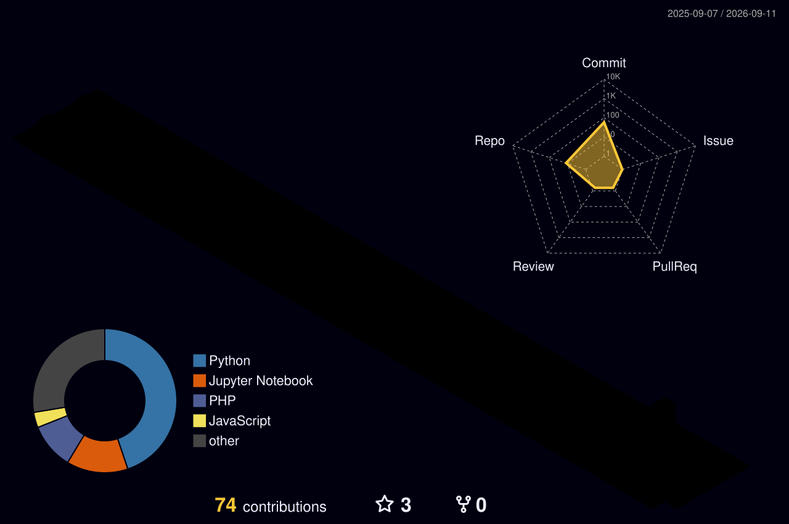

 

## ⚡ About

B.Tech Information Technology (Data Science) student building across the ML lifecycle — from classical model development (TensorFlow, PyTorch, Scikit-learn) to LLM agent workflows (RAG, LangChain, LangGraph, Groq, Gemini Vision).

Completed a 6-month virtual research internship with **National Chung Cheng University (NCCU), Taiwan**, applying deep learning to medical image classification. Comfortable integrating AI APIs into production-grade, full-stack applications (FastAPI, Node.js, React, MySQL).

<table>
<tr>
<td width="52%" valign="top">

**🎯 Focus areas**
- RAG and multi-agent LLM pipelines
- Computer vision — CNNs, YOLO, OCR
- Edge-deployed inference on resource-constrained hardware
- Full-stack integration of AI systems

**📍 Based in** India &nbsp;·&nbsp; **📧** yashdabhade0106@gmail.com

</td>
<td width="48%" valign="top">

</td>
</tr>
</table>

## 🧬 Core Strengths

| 🧠 LLM Pipeline Builder | 👁️ Computer Vision | ⚡ Edge AI Deployment |
|:---|:---|:---|
| RAG & multi-agent flows | CNN fine-tuning (VGG16/ResNet) | ARM64 optimization |
| Prompt & tool design | YOLO / OCR pipelines | Resource-constrained ML |
| API observability (Langfuse) | Medical image research | Real-time inference |

## 🛠️ Technical Skills

**Languages**
 

**AI / ML / LLM Tooling**
 

**Web & Backend**
 

**Data & Databases**
 

**Tools**
 

Also familiar with: JavaScript, TypeScript, PHP, Kotlin, Angular, Django, Bootstrap, Tailwind, PostgreSQL, AWS, Firebase, Spring, Android, Arduino

## 🚀 Featured Projects

<table>
<tr>
<td width="33%" valign="top">

### 🩺 MedAssist
**AI Pharmacy Management System**

3-stage NLP agent pipeline (Extractor → Safety → Executor) parsing natural-language medicine orders via fuzzy matching + Groq LLM. Gemini Vision for prescription OCR, Sarvam AI for multilingual translation, Langfuse observability.

[`→ View on GitHub`](#)

</td>
<td width="33%" valign="top">

### 🏭 Edge AI Monitoring
**Industrial Fault Detection Platform**

AI inference module classifying 13+ fault categories with confidence scoring (Scikit-learn + ONNX) on ARM64 hardware — under 250MB RAM / 40% CPU.

[`→ View on GitHub`](#)

</td>
<td width="33%" valign="top">

### 🚗 Plate Detection
**OpenCV & Tesseract OCR**

Grayscale → edge detection → contour localization → OCR pipeline, tuned YOLOv5 thresholds, exposed as a REST API via Flask.

[`→ View on GitHub`](#)

</td>
</tr>
</table>

## 🔬 Research Experience

**Machine Learning Intern — Hyperspectral Virtual Internship**
Sanjivani College of Engineering × National Chung Cheng University (NCCU), Taiwan · Apr 2025 – Sep 2025

## 📊 GitHub Activity

 

 

 

 

These widgets run on a shared public service that occasionally times out under load — if a card doesn't render, refresh or open the image in a new tab.

## 🏆 Certifications & Achievements

| Achievement | Detail |
|:---|:---|
| 🥉 Hackfusion 3.0 Hackathon | 4th Place |
| ✅ Smart India Hackathon (SIH) | Internal Qualifier |
| ✅ Cybage Tech Fest & RBI@90 Quiz | State-Level Qualifier |
| 📜 Career Essentials in GenAI | Microsoft & LinkedIn |
| 📜 McKinsey Forward Program | Completed |
| 📜 Google Cloud Data Analytics Track | Completed |
| 📜 AWS Cloud Foundations | Completed |
| 📜 NPTEL | Java, Python |
| 📜 Local AI: Build a RAG Model from Scratch | Open-Source Tools |

## 📬 Connect

